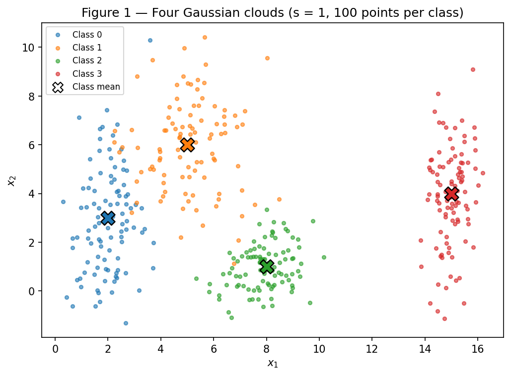
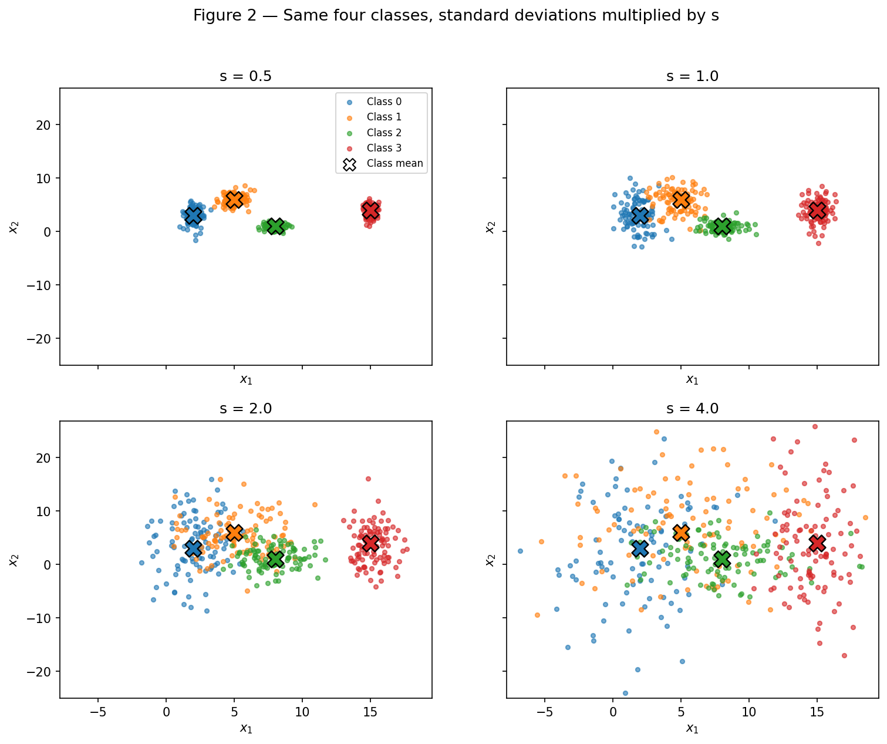
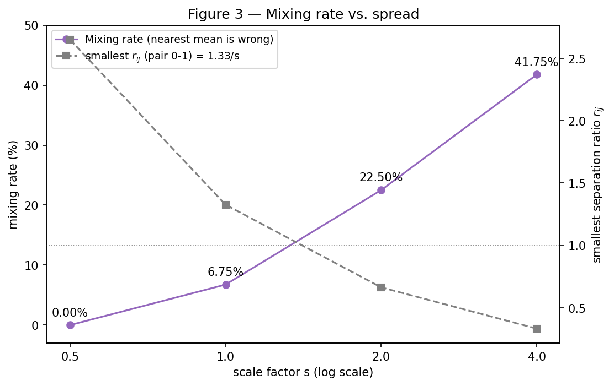
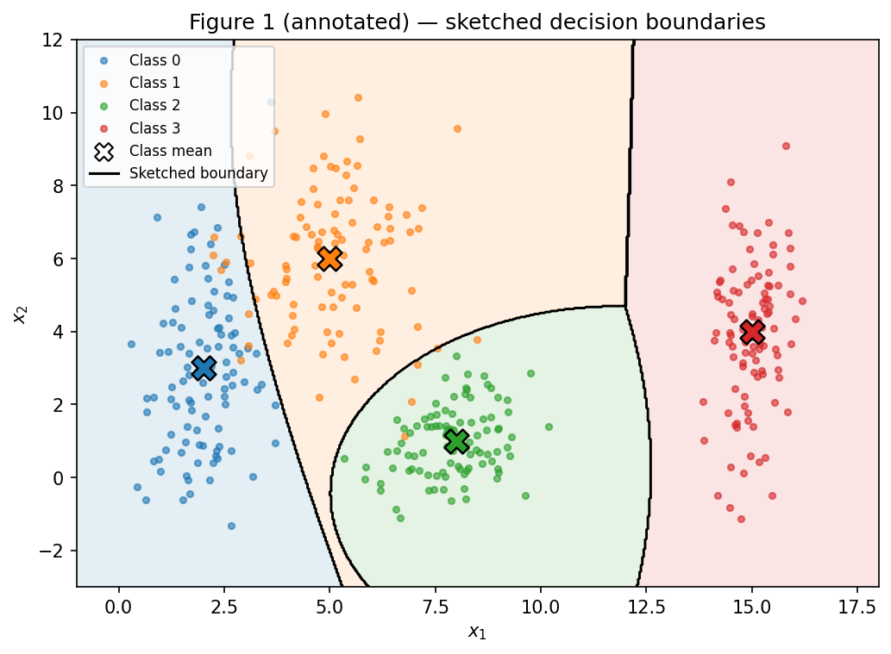
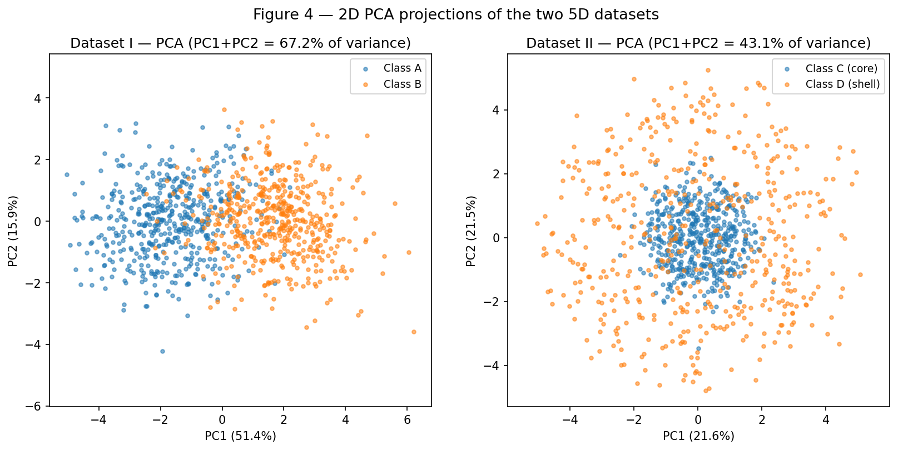
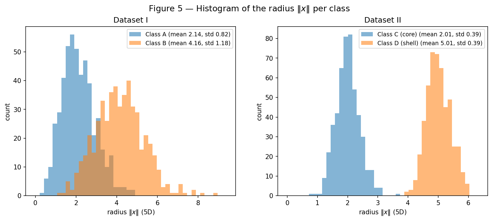
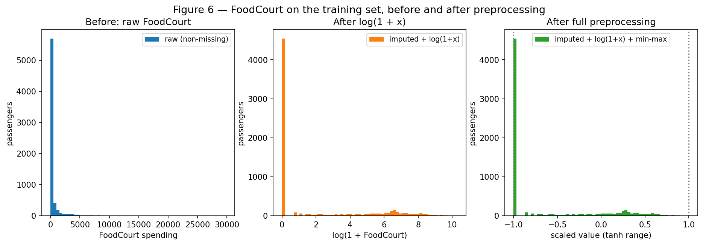

# Data — Data Preparation and Analysis for Neural Networks

**Approach.** Everything in this report is produced by a single script,
[`code/data.py`](code/data.py), which creates **one** generator
`rng = np.random.default_rng(42)` and uses it for every random draw, in the order of the statement.
Running it from the repository root

```shell
python docs/exercises/data/code/data.py
```

regenerates all the figures in `figures/` and every number quoted below
(`figures/results.json`); two consecutive runs produce byte-identical outputs.
Only NumPy, pandas, Matplotlib and scikit-learn (PCA and preprocessing) are used — no model is trained.
The code blocks below are the corresponding sections of that file.

??? note "Setup (imports, seed, helpers)"

    ```python
    --8<-- "docs/exercises/data/code/data.py:setup"
    ```

## Exercise 1

### A — Generate the clouds

Four classes of 100 points each are drawn from Gaussians with the given means and standard deviations.
Each coordinate is drawn independently, so the std vector $[\sigma_x, \sigma_y]$ is exactly the spread
along each axis.

```python
--8<-- "docs/exercises/data/code/data.py:ex1a"
```



*Figure 1 — The 400 points, one colour per class; the X marks the mean of each cloud.*

### B — More or less spread out

**Four datasets.** The same four classes were generated again for $s \in \{0.5, 1.0, 2.0, 4.0\}$
(means fixed, every standard deviation multiplied by $s$). The four panels share the same axis limits.

```python
--8<-- "docs/exercises/data/code/data.py:ex1b_generate"
```



*Figure 2 — The same four classes at four spreads, on shared axes.*

**Separation ratio at $s = 1$.**
$\bar\sigma_k = (\sigma_{k,x} + \sigma_{k,y})/2$ gives $\bar\sigma = [1.65,\ 1.55,\ 0.90,\ 1.25]$ for classes 0–3.

```python
--8<-- "docs/exercises/data/code/data.py:ex1b_ratio"
```

| Pair $(i,j)$ | $\lVert\mu_i-\mu_j\rVert$ | $\bar\sigma_i+\bar\sigma_j$ | $r_{ij}$ |
|:---:|---:|---:|---:|
| **0 – 1** | **4.243** | **3.20** | **1.326** |
| 0 – 2 | 6.325 | 2.55 | 2.480 |
| 0 – 3 | 13.038 | 2.90 | 4.496 |
| 1 – 2 | 5.831 | 2.45 | 2.380 |
| 1 – 3 | 10.198 | 2.80 | 3.642 |
| 2 – 3 | 7.616 | 2.15 | 3.542 |

The smallest ratio is **$r_{01} = 1.326$ (classes 0 and 1)**. Since the means do not move and every
$\sigma$ is multiplied by $s$, $r_{ij}(s) = r_{ij}(1)/s$; at $s = 2$ it becomes
**$r_{01} = 1.326/2 = 0.663$** — the distance between the two means is then smaller than the sum of their
average spreads.

**Mixing rate** (fraction of points whose nearest class mean is not their own):

```python
--8<-- "docs/exercises/data/code/data.py:ex1b_mixing"
```

| $s$ | Mixing rate | Mixed points | Smallest $r_{ij}$ ($=1.326/s$) | Pairs **not** separable by a straight line |
|:---:|---:|---:|---:|:---|
| 0.5 | **0.00 %** | 0 / 400 | 2.652 | none |
| 1.0 | **6.75 %** | 27 / 400 | 1.326 | 0–1, 1–2 |
| 2.0 | **22.50 %** | 90 / 400 | 0.663 | 0–1, 0–2, 1–2 |
| 4.0 | **41.75 %** | 167 / 400 | 0.331 | all six pairs |

At $s = 1$ the 27 mixed points are almost all between classes 0 and 1 (11 + 11), plus 1 point of class 0
and 4 of class 1 closer to the mean of class 2; classes 2 and 3 have no mixed points.



*Figure 3 — Mixing rate against $s$ (purple, left axis) and the smallest separation ratio (grey,
right axis; the dotted line marks $r = 1$).*

**From which scale factor on can the clouds no longer be separated by straight lines?**
**From $s = 1$ on.** At $s = 0.5$ every pair can be split by a line (the mixing rate is 0 % and the
exhaustive line test in the code finds a separating line for all six pairs). At $s = 1$ the smallest
ratio has dropped to $r_{01} = 1.33$: the 0/1 clouds are only 1.33 "average spreads" apart, their tails
interpenetrate, and no straight line separates classes 0–1 (nor 1–2) any more — the mixing rate
becomes 6.75 %. At $s = 2$ the smallest ratio falls **below 1** ($r_{01} = 0.66$): the overlap is no
longer a matter of a few tail points but of the cores of the clouds, and the mixing rate jumps to 22.5 %;
at $s = 4$ ($r_{01} = 0.33$) even the isolated class 3 mixes and no pair is separable.

### C — Analysis

**Overlap at $s = 1$.** Class 3 is isolated far to the right ($r_{3j} \ge 3.5$ for every $j$) and class 2
is compact ($\bar\sigma_2 = 0.9$), so both are easy. Classes 0 and 1 are the problem: their means are
only 4.24 apart while class 0 is very tall ($\sigma_y = 2.5$) and class 1 wide ($\sigma_x = 1.2$), so their
tails meet around $x_1 \approx 3$, $x_2 \approx 5$–$7$ ($r_{01} = 1.33$, 22 of the 27 mixed points).
Class 1 also touches class 2 at its lower edge (4 points).

**A single linear boundary** cannot separate four classes: one line cuts the plane into only two
half-planes. **A set of linear boundaries** can do most of the job — the nearest-mean rule is itself a
set of straight lines (the perpendicular bisectors between means) and it classifies 93.25 % of the points
at $s = 1$ — but not all of it: the line test shows that pairs 0–1 and 1–2 cannot be split perfectly by
*any* straight line, so some error remains whatever lines are chosen.

**Sketched boundaries.** The sketch below is drawn on Figure 1 as the boundaries a well-trained network
should approach: the Bayes-optimal regions computed from the *true* generating Gaussians (nothing is
fitted). A near-vertical boundary at $x_1 \approx 12$ isolates class 3; a closed curved boundary wraps the
round, compact class 2; and a steep, tilted curve between classes 0 and 1 follows the tall shape of
class 0. The boundaries are curved because the classes have different spreads — a network with
non-linear hidden units can bend its boundaries this way; a single perceptron cannot.

```python
--8<-- "docs/exercises/data/code/data.py:ex1c"
```



*Figure 1 (annotated) — Figure 1 with the sketched decision boundaries (black) and the resulting regions.*

**Relation to item B.** Even with those optimal boundaries, 3.75 % of the points at $s = 1$ fall on the
wrong side: this is the region where the network *necessarily* makes mistakes, because both classes
genuinely produce points there. The more spread out the clouds, the larger that region — the share of
points on the wrong side of the optimal boundaries goes **0 % → 3.75 % → 17.0 % → 32.5 %** for
$s = 0.5, 1, 2, 4$, tracking the mixing rate (0 % → 6.75 % → 22.5 % → 41.75 %). Spreading the data does
not only make the boundary harder to learn; it raises the floor of error that no network can go below.

## Exercise 2

### A — Dataset I: shifted Gaussians

500 samples per class from $\mathcal{N}(\mu_A, \Sigma_A)$ and $\mathcal{N}(\mu_B, \Sigma_B)$ with the given
parameters. Both matrices are checked to be symmetric positive-definite before sampling.

```python
--8<-- "docs/exercises/data/code/data.py:ex2a"
```

### B — Dataset II: concentric shells

Directions are drawn as $v \sim \mathcal{N}(0, I_5)$ and normalised, $u = v/\lVert v\rVert$, which makes
them uniform on the unit sphere of $\mathbb{R}^5$ (the isotropic Gaussian has no preferred direction).
Radii are $\rho \sim \mathcal{N}(2.0, 0.4)$ for class C and $\rho \sim \mathcal{N}(5.0, 0.4)$ for class D
(0.4 taken as the standard deviation), and $x = \rho\,u$.

```python
--8<-- "docs/exercises/data/code/data.py:ex2b"
```

### C — Visualize and compare

```python
--8<-- "docs/exercises/data/code/data.py:ex2c"
```



*Figure 4 — PCA projection of each 5D dataset onto its first two principal components.*

| | PC1 | PC2 | **PC1 + PC2** | Distance between class centers (5D) |
|---|---:|---:|---:|---:|
| Dataset I | 51.35 % | 15.88 % | **67.23 %** | **3.405** (theoretical $\lVert\mu_B-\mu_A\rVert = 1.5\sqrt5 = 3.354$) |
| Dataset II | 21.64 % | 21.47 % | **43.10 %** | **0.235** (theoretical 0) |

**Which 2D projection better preserves the information relevant for classification? Dataset I.** Its
classes differ by a shift along $(1,1,1,1,1)$, which is also the direction of largest variance of the
pooled data, so PC1 (51 % of the variance) is essentially the axis that separates A from B, and the two
classes appear side by side in Figure 4. In Dataset II the pooled data is isotropic — all five components
carry about 20 % of the variance (21.6 % and 21.5 % for the first two) — so PCA has no meaningful
direction to choose, keeps only 43 % of the variance, and the class information (the *radius*) is spread
across all five coordinates. In its projection, class D points whose direction lies mostly in the three
discarded components land in the middle, on top of class C.



*Figure 5 — Histogram of $\lVert x\rVert$ computed in 5D, per class, for both datasets.*

| Radius $\lVert x \rVert$ (5D) | mean | std | min | max |
|---|---:|---:|---:|---:|
| Dataset I — class A | 2.14 | 0.82 | 0.42 | 4.80 |
| Dataset I — class B | 4.16 | 1.18 | 1.14 | 8.93 |
| Dataset II — class C (core) | 2.01 | 0.39 | 0.85 | 3.66 |
| Dataset II — class D (shell) | 5.01 | 0.39 | 3.95 | 6.02 |

In Dataset I the radii overlap heavily (the classes differ by *position*, not by radius); in Dataset II
the two radius distributions do not overlap at all — the largest core radius (3.66) is below the smallest
shell radius (3.95).

### D — Analysis

```python
--8<-- "docs/exercises/data/code/data.py:ex2d"
```

**Coincident centers, separated radii.** In Dataset II the class centers are 0.235 apart (≈ 0; the
residual is sampling noise), yet the radii are perfectly separated. Any hyperplane $w^\top x + b = 0$
splits space into two half-spaces; because both classes are spread symmetrically around the same center,
every half-space that contains part of the core also contains a comparable part of the shell. The
hyperplane through the midpoint of the two class means, perpendicular to their difference, confirms it:
it classifies Dataset I with **89.3 %** accuracy but Dataset II with only **54.0 %** — chance level.

**Why no linear boundary works, no matter how much data.** The shell surrounds the core in every
direction: the convex hull of class D contains the whole ball in which class C lives. A half-space is
convex, so a half-space that contains every point of D also contains its convex hull — and therefore C.
Hence no hyperplane can have D on one side and C on the other. Collecting more data only fills the shell
more densely, making its convex hull an even more complete ball; the obstruction is the geometry of the
problem (C *inside* D), not a lack of samples.

**Does a mixed 2D projection prove inseparability? No.** PCA is a linear map that here throws away
57 % of the variance of Dataset II; points that are far apart in 5D (on opposite sides of the radius gap)
can land on top of each other in 2D. Our own results show it: in Figure 4 the classes of Dataset II look
mixed, yet in 5D the radius separates them completely (Figure 5). Mixing in a projection only proves that
*that particular* projection is not enough. A simple function of the inputs that separates Dataset II is

$$
f(x) = \lVert x\rVert^2 - R^2 = \sum_{i=1}^{5} x_i^2 - 3.5^2,
\qquad f(x) > 0 \Rightarrow \text{shell (D)},\quad f(x) < 0 \Rightarrow \text{core (C)},
$$

with $R = 3.5$ halfway between the two shell radii. It classifies **99.9 %** of the 1000 points (the only
error is the single core point with radius 3.66, visible in Figure 5; any $R$ between 3.66 and 3.95 would
give 100 % on this sample). Note that $f$ is **linear in the squared features** $z_i = x_i^2$: a
non-linear transformation of the inputs turns the problem into a linearly separable one — exactly what the
hidden layers of a deep network learn to do.

## Exercise 3

### A — Get to know the data

```python
--8<-- "docs/exercises/data/code/data.py:ex3a"
```

**Goal.** [Spaceship Titanic](https://www.kaggle.com/competitions/spaceship-titanic/data)
(`train.csv`, 8693 passengers × 14 columns, committed at `data/train.csv`) describes the passengers of a
spaceship that hit a spacetime anomaly. The target **`Transported`** says whether the passenger was
transported to an alternate dimension (`True`) or not (`False`) — a binary classification problem.

**Class balance.** `True` 4378 (**50.36 %**) vs `False` 4315 (49.64 %) — practically balanced.

**Features.**

| Type | Columns |
|---|---|
| Numerical | `Age`, `RoomService`, `FoodCourt`, `ShoppingMall`, `Spa`, `VRDeck` (the last five are amounts spent) |
| Categorical | `HomePlanet` (Earth / Europa / Mars), `Destination` (3 planets), `CryoSleep` (bool), `VIP` (bool) |
| Identifiers / text | `PassengerId` (group_member id), `Cabin` (deck/num/side string), `Name` |

**Missing values** (full file):

| Column | Missing | % |
|---|---:|---:|
| PassengerId | 0 | 0.00 |
| HomePlanet | 201 | 2.31 |
| CryoSleep | 217 | 2.50 |
| Cabin | 199 | 2.29 |
| Destination | 182 | 2.09 |
| Age | 179 | 2.06 |
| VIP | 203 | 2.34 |
| RoomService | 181 | 2.08 |
| FoodCourt | 183 | 2.11 |
| ShoppingMall | 208 | 2.39 |
| Spa | 183 | 2.11 |
| VRDeck | 188 | 2.16 |
| Name | 200 | 2.30 |
| Transported | 0 | 0.00 |

Every feature column is missing roughly 2–2.5 % of its values; only the identifier and the target are
complete.

**Spending columns** (full file, non-missing values):

| Column | Mean | Median | Max | Zeros | Skewness |
|---|---:|---:|---:|---:|---:|
| RoomService | 224.69 | 0 | 14 327 | 64.2 % | 6.33 |
| FoodCourt | 458.08 | 0 | 29 813 | 62.8 % | 7.10 |
| ShoppingMall | 173.73 | 0 | 23 492 | 64.3 % | 12.63 |
| Spa | 311.14 | 0 | 22 408 | 61.2 % | 7.64 |
| VRDeck | 304.85 | 0 | 24 133 | 63.2 % | 7.82 |

**Mean × median.** The median is **0** in all five columns — more than 60 % of the passengers spend
nothing — while the means are in the hundreds and the maxima in the tens of thousands. A mean far above
the median means the average is pulled up by a few very large values: the distributions are extremely
**right-skewed** (skewness 6–13) with a long, heavy tail and an enormous spread (the maximum is 64–135 times
the mean). Such a feature, fed raw, would be dominated by a handful of big spenders.

### B — Split before you transform

```python
--8<-- "docs/exercises/data/code/data.py:ex3b"
```

The data is split 80/20, stratified by `Transported`, with `random_state=42`: **6954** training and
**1739** test passengers, with 50.36 % and 50.37 % positives respectively.

**Why split first.** Imputation and scaling *learn* statistics — medians, modes, minima and maxima, the
list of categories. If they were computed on the full file, information from the test passengers would be
baked into the transformation of the training data, and the test set would no longer be unseen data: the
reported performance would be optimistic (data leakage). Splitting first and fitting every transformer on
the training set only keeps the test set an honest simulation of new passengers.

### C — Preprocess

```python
--8<-- "docs/exercises/data/code/data.py:ex3c"
```

**Missing data** (all statistics learned on the training set, then applied to both sets):

* **Numerical → median.** The spending columns are heavily skewed, and the median is robust to their
  tails; for them it is **0**, which is also the most common real value (most passengers — and every
  passenger in cryosleep — spend nothing). For `Age` the training median is **27**. A mean would be
  pulled up by the outliers (452.61 for FoodCourt) and would invent spending that almost nobody does.
* **Categorical → most frequent.** Only ~2 % of each column is missing, so filling with the training
  mode (`Earth`, `CryoSleep=False`, `TRAPPIST-1e`, `VIP=False`) barely changes the distributions and
  keeps every value a valid category.

**Categorical features.** `HomePlanet`, `CryoSleep`, `Destination` and `VIP` are one-hot encoded with the
categories observed in the **training** set (10 binary columns). The encoder uses
`handle_unknown="ignore"`: a category that appears in the test set but not in training becomes a row of
**zeros** in that feature's block instead of an error — the code checks this with an invented
`HomePlanet = "Pluto"`, which is encoded as `[0, 0, 0]`.

**Feature engineering.** `TotalSpend` is the sum of the five (imputed) spending columns; `Cabin`, `Name`
and `PassengerId` are dropped.

**Heavy tails.** $\log(1+x)$ is applied to the five spending columns and to `TotalSpend` (the $+1$ keeps
the many zeros at 0). For FoodCourt it maps $[0, 29\,813]$ to $[0, 10.3]$ (Figure 6, first two panels).
Why it helps a tanh network: without it, scaling to $[-1, 1]$ would be dictated by the single largest
spender, and the great majority of passengers, who spend ordinary amounts, would be squeezed into a
tiny interval near $-1$, indistinguishable to the network; meanwhile the extreme values would produce large pre-activations
that push tanh into its flat, saturated region, where its gradient is almost zero and learning stalls.
The log compresses the tail so that differences between 10, 100 and 1000 credits become comparable steps.

**Scaling.** The 7 numerical columns (`Age`, the five log-spending columns and `log TotalSpend`) are
normalised to **$[-1, 1]$** with `MinMaxScaler(feature_range=(-1, 1))` fitted on the training set. I chose
normalisation over standardisation because it matches the output range of tanh exactly and gives
**bounded** inputs, whereas standardisation of these still-skewed columns would leave values several
standard deviations away from 0. The one-hot columns are already in $\{0, 1\} \subset [-1, 1]$.
Resulting ranges: training set **min = −1.000, max = 1.000**; test set **min = −1.000, max = 1.138**.
The test set exceeds 1 in only **2 values** (one ShoppingMall at 1.138 and one VRDeck at 1.035):
test passengers who spent more than anyone in the training set. This is the expected, correct behaviour of
a scaler fitted on training data only, and such values are harmless for tanh.

### D — Verify and visualize

```python
--8<-- "docs/exercises/data/code/data.py:ex3d"
```



*Figure 6 — FoodCourt on the training set: raw (left), after imputation + $\log(1+x)$ (middle), and after
the full pipeline (right, dotted lines at ±1).*

**Final checks.**

* Remaining NaN: **0** in the training matrix and **0** in the test matrix.
* Final shape of the feature matrix: training **(6954, 17)**, test **(1739, 17)** — 7 scaled numerical
  columns + 10 one-hot columns.
* Value range: training **[−1.000, 1.000]**, test **[−1.000, 1.138]** — compatible with tanh (centred on
  0, bounded, only 2 test values slightly beyond 1).

**Reflection.** The decision I expect to affect training the most is the treatment of the spending
columns — the $\log(1+x)$ followed by scaling. Five of the seven numerical inputs (plus `TotalSpend`) are
heavy-tailed with a median of 0 and maxima near 30 000; fed raw, or merely min-max scaled, almost every
passenger would sit at the same value while a few outliers would saturate the tanh units and dominate the
gradient updates, making training slow and unstable. After the log, the information in *how much* a
passenger spent is spread over the whole $[-1, 1]$ range (Figure 6). The imputation choices matter much
less here because only about 2 % of each column is missing, and fitting every statistic on the training
set does not change the numbers much, but it is what makes the test evaluation trustworthy.

## Results summary

| # | Item | Your value |
|---|---|---|
| 1 | Mixing rate at $s = 0.5$ | **0.00 %** (0 / 400) |
| 2 | Mixing rate at $s = 1.0$ | **6.75 %** (27 / 400) |
| 3 | Mixing rate at $s = 2.0$ | **22.50 %** (90 / 400) |
| 4 | Mixing rate at $s = 4.0$ | **41.75 %** (167 / 400) |
| 5 | Smallest $r_{ij}$ at $s = 1.0$, and which pair | **$r_{01} = 1.326$**, classes **0 and 1** (0.663 at $s = 2$) |
| 6 | Distance between centers — Dataset I | **3.405** |
| 7 | Distance between centers — Dataset II | **0.235** |
| 8 | Explained variance PC1 + PC2 — Dataset I | **67.23 %** (51.35 % + 15.88 %) |
| 9 | Explained variance PC1 + PC2 — Dataset II | **43.10 %** (21.64 % + 21.47 %) |
| 10 | Share of the positive class in `Transported` | **50.36 %** (4378 / 8693) |
| 11 | Mean and median of `FoodCourt` on the training set, before transforming | **mean 452.61**, **median 0.00** |
| 12 | Final shape of the training feature matrix | **(6954, 17)** |
| 13 | Minimum and maximum of the training and test sets after scaling | train **[−1.000, 1.000]**; test **[−1.000, 1.138]** |
