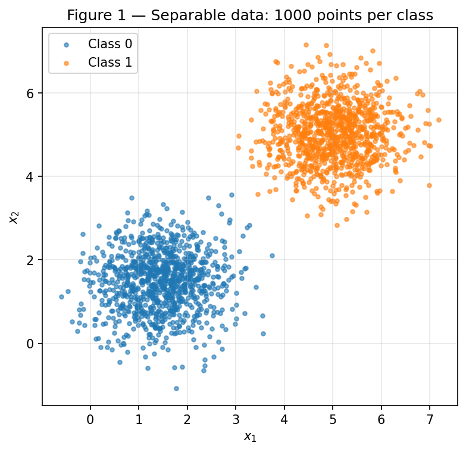
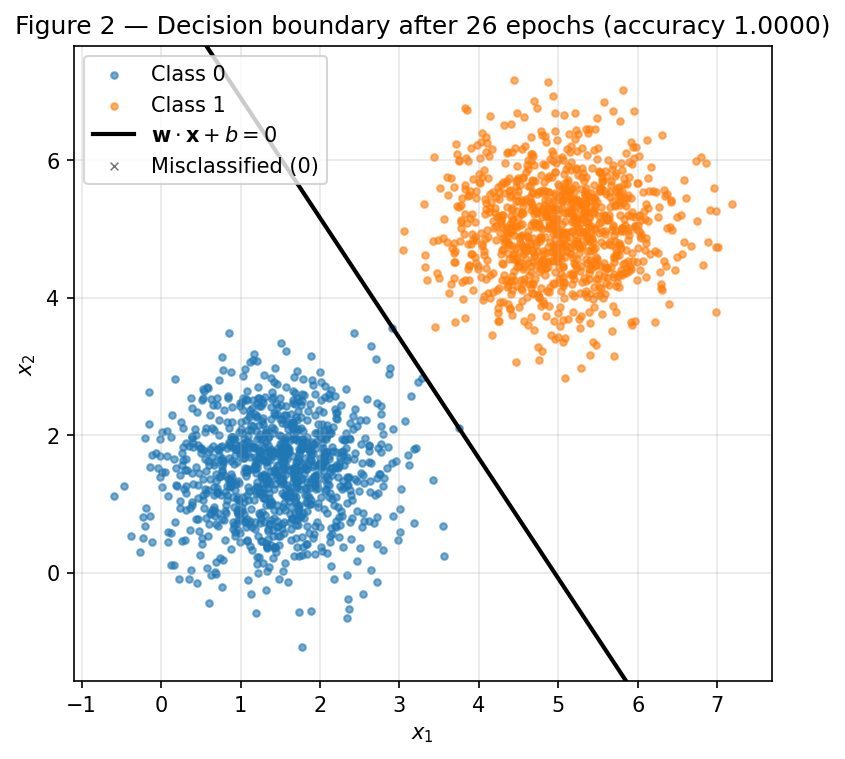
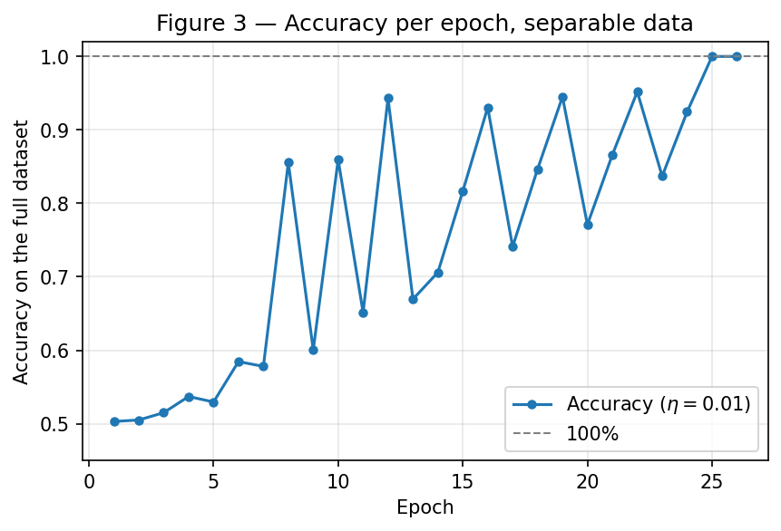
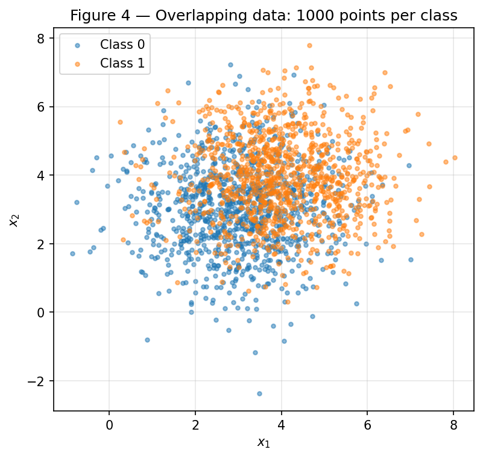
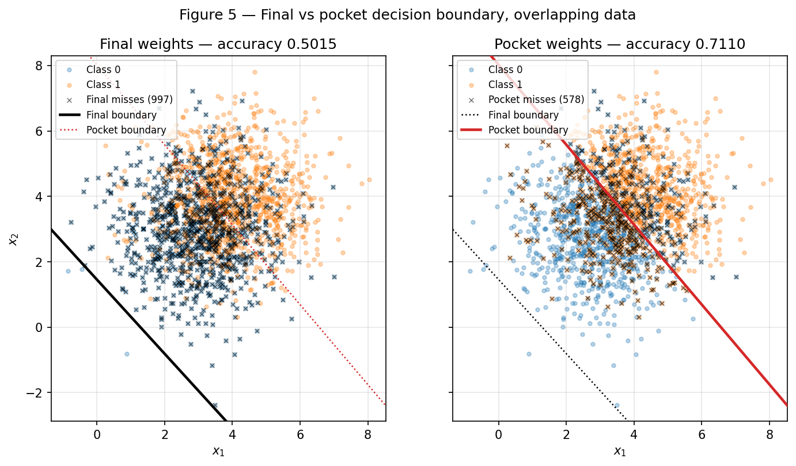
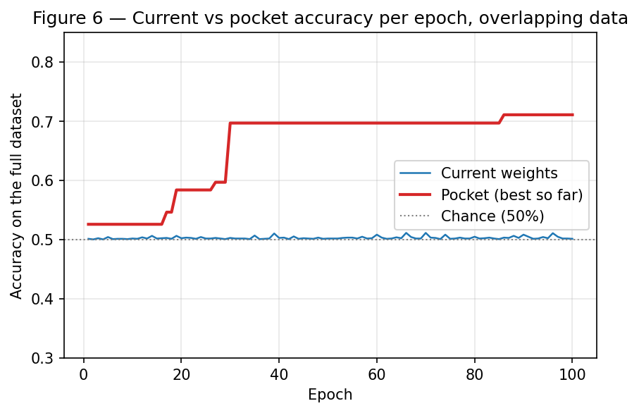

# Perceptron — Understanding Perceptrons and Their Limitations

**Approach.** Everything in this report is produced by a single script,
[`code/perceptron.py`](code/perceptron.py), which creates **one** generator
`rng = np.random.default_rng(42)` and uses it for every random draw, in the order of the statement:
Exercise 1 data → Exercise 1 initialization → Exercise 2 data → Exercise 2 initialization.
Running it from the repository root

```shell
python docs/exercises/perceptron/code/perceptron.py
```

regenerates the six figures in `figures/` and every number quoted below
(`figures/results.json`); two consecutive runs produce byte-identical outputs.
Only NumPy and Matplotlib are used — the activation, the prediction, the update rule, the training
loop and the pocket are written from scratch, and no third-party model appears anywhere in the file.

**Challenges.** Two things were not obvious at first. The first is that the *epoch-end* accuracy of
Exercise 1 (Figure 3) is a sawtooth, not a smooth climb: the samples are presented in the order they
were generated — the 1000 points of class 0, then the 1000 of class 1 — so within one epoch the
boundary is pushed one way by the first block and back by the second, and where it happens to sit at
the end of the epoch is what gets measured. The second is the mechanism behind the ~50% of
Exercise 2, which item **2.D** explains: each mistake moves $b$ by $\eta$ but $\mathbf{w}$ by
$\eta \lVert \mathbf{x} \rVert \approx 5\eta$, so the boundary is effectively pinned near the origin
and cannot reach a cloud that lives about 5 units away.

??? note "Setup (imports, seed, data generator, helpers)"

    ```python
    --8<-- "docs/exercises/perceptron/code/perceptron.py:setup"
    ```

??? note "Plotting helpers (scatter, boundary, misclassified points)"

    ```python
    --8<-- "docs/exercises/perceptron/code/perceptron.py:plothelpers"
    ```

## Exercise 1

Separable data: the case the perceptron was designed for.

### A — Generate the data

1000 points per class, drawn from $\mathcal{N}(\mu_k, \Sigma)$ with
$\mu_0 = [1.5, 1.5]$, $\mu_1 = [5, 5]$ and
$\Sigma = [[0.5, 0], [0, 0.5]]$. The means are $\lVert \mu_1 - \mu_0 \rVert = 4.95$
apart while each cloud has $\sigma = \sqrt{0.5} = 0.71$ per axis, so the clouds are separated by an
empty corridor — measured along the direction joining the means, the gap between the two projections
is $2\gamma = 0.386$.

```python
--8<-- "docs/exercises/perceptron/code/perceptron.py:ex1a"
```



*Figure 1 — The 2000 points, one colour per class.*

### B — Implement the perceptron

The model is a single function, written once and reused unchanged by Exercise 2 (the `pocket`
argument is the only addition, and it never touches the update rule):

```python
--8<-- "docs/exercises/perceptron/code/perceptron.py:perceptron"
```

Three details worth stating explicitly:

- **the error is $y - \hat{y}$ with $y, \hat{y} \in \{0, 1\}$**, so a correct prediction produces no
  update at all, a false negative produces $+1$ and a false positive $-1$. The textbook form
  $\mathbf{w} \leftarrow \mathbf{w} + \eta\, y\, \mathbf{x}$ belongs to the $\pm 1$ convention and
  would never update on class 0 here;
- **the initialization is non-zero**: $\mathbf{w}_0 = [0.002532, 0.008952]$ drawn from
  `rng.normal(0, 0.01, size=2)`, $\lVert \mathbf{w}_0 \rVert = 0.00930$, and $b = 0$;
- **the loop is per-sample** (online), and stops on the first epoch that produces zero updates, or at
  100 epochs.

### C — Train and measure

```python
--8<-- "docs/exercises/perceptron/code/perceptron.py:ex1c"
```

With $\eta = 0.01$ the run converges:

| Quantity | Value |
|:---|---:|
| Final $\mathbf{w}$ | $[0.050497,\ 0.028872]$ |
| Final $b$ | $-0.25$ |
| Epochs | **26** (25 epochs with updates + 1 clean pass) |
| Total updates | 73 |
| Final accuracy | **1.0000** (0 of 2000 misclassified) |



*Figure 2 — The boundary $\mathbf{w} \cdot \mathbf{x} + b = 0$ after training; it passes through the
empty corridor, and no point is misclassified.*



*Figure 3 — Accuracy on the full dataset measured at the end of every epoch. The sawtooth is the
presentation order (class 0 block, then class 1 block) pushing the boundary back and forth inside
one epoch; the envelope rises steadily until the boundary lands in the corridor at epoch 25.*

### D — Analysis

**Why separable data converges quickly.** The update is driven by the error $(y - \hat{y})$, which is
exactly $0$ on every correctly classified sample. A pass over the data therefore costs one update per
*mistake* and nothing else, and once the boundary sits inside the empty corridor between the clouds
there are no mistakes left — a full pass produces no update and the loop stops. That state is a fixed
point of the algorithm, not an approximation being refined. The update counts per epoch show it:

```text
3, 3, 4, 4, 3, 4, 3, 4, 2, 4, 2, 4, 2, 3, 3, 3, 2, 3, 3, 2, 3, 3, 2, 3, 1, 0
```

Only 73 updates are spent in 2000 × 26 = 52 000 sample presentations: the model is already right
about almost every point from the first epoch on, and each of those few mistakes translates the
boundary by a fixed amount. What it is doing over those 26 epochs is walking the boundary outward
until it reaches the corridor: the offset $-b / \lVert \mathbf{w} \rVert$ ends at **4.298**, which
lands between the projections of the two clouds. The convergence theorem gives the same conclusion in
the abstract: with $R = \max \lVert \mathbf{x} \rVert = 9.12$ and $\gamma = 0.193$ (half the gap
above), the total number of mistakes is bounded by $(R/\gamma)^2 = 2237$ — a finite number, and the
run needed only 73.

**Re-run with $\eta = 1.0$.** Same data, same code, same $\mathbf{w}_0$ — only $\eta$ changes:

```python
--8<-- "docs/exercises/perceptron/code/perceptron.py:ex1d"
```

| | $\eta = 0.01$ | $\eta = 1.0$ |
|:---|---:|---:|
| Epochs | 26 | **37** |
| Total updates | 73 | 101 |
| Final accuracy | 1.0000 | **1.0000** |
| Final $b$ | $-0.25$ | $-31.0$ |
| $\lVert \mathbf{w} \rVert$ | 0.05817 | 6.7638 |
| $\mathbf{w} / \lVert \mathbf{w} \rVert$ | $[0.86812,\ 0.49635]$ | $[0.86795,\ 0.49665]$ |
| Offset $-b / \lVert \mathbf{w} \rVert$ | 4.298 | 4.583 |

Both runs reach 100%, and the two directions are **0.020° apart** (cosine $0.99999994$), while the
magnitudes differ by a factor of 116 and the boundaries sit at different offsets (4.298 against
4.583), which is why the epoch counts differ (26 against 37).

That is what $\eta$ controls. Every update adds $\eta (y - \hat{y}) \mathbf{x}$ to weights that
started at $\lVert \mathbf{w}_0 \rVert \approx 0.0093$. With $\eta = 0.01$ a single update has size
$\eta \lVert \mathbf{x} \rVert \approx 0.05$ — the same order as the initialization, so
$\mathbf{w}_0$ is still a visible part of the final weights. With $\eta = 1.0$ an update has size
$\approx 5$, five hundred times the initialization, so $\mathbf{w}_0$ is erased by the first mistake.
$\eta$ decides **how much of the final solution is the initialization and how much is the mistakes** —
not which direction the mistakes point to. Since both runs face the same data, the mistake sequences
are nearly the same and the directions end up nearly identical; what survives of the difference is
the small tilt inherited from $\mathbf{w}_0$, and through it a different offset and a different
number of epochs. For a *separable* problem $\eta$ cannot change the outcome, only the path: any
boundary inside the corridor stops the loop.

**What would have happened from $\mathbf{w} = \mathbf{0}$, $b = 0$.** Then $\eta$ would not even
change the path. Write $(\mathbf{w}_t^{(\eta)}, b_t^{(\eta)})$ for the iterates produced with rate
$\eta$ from the zero start, and claim $\mathbf{w}_t^{(\eta)} = \eta\, \mathbf{w}_t^{(1)}$,
$b_t^{(\eta)} = \eta\, b_t^{(1)}$ for every $t$.

*Base case*: $\mathbf{w}_0^{(\eta)} = \mathbf{0} = \eta \cdot \mathbf{0}$ and $b_0^{(\eta)} = 0 = \eta \cdot 0$.

*Induction step*: assume it holds at step $t$. The prediction for the next sample is

$$
\hat{y} = \text{step}\!\left( \mathbf{w}_t^{(\eta)} \cdot \mathbf{x} + b_t^{(\eta)} \right)
        = \text{step}\!\left( \eta \left[ \mathbf{w}_t^{(1)} \cdot \mathbf{x} + b_t^{(1)} \right] \right)
        = \text{step}\!\left( \mathbf{w}_t^{(1)} \cdot \mathbf{x} + b_t^{(1)} \right),
$$

because $\eta > 0$ does not change the sign of the argument, and $\text{step}$ only looks at that
sign. So both runs make the *same* prediction, hence the same error $e = y - \hat{y}$, and

$$
\mathbf{w}_{t+1}^{(\eta)} = \eta\, \mathbf{w}_t^{(1)} + \eta\, e\, \mathbf{x}
 = \eta \left( \mathbf{w}_t^{(1)} + e\, \mathbf{x} \right) = \eta\, \mathbf{w}_{t+1}^{(1)},
\qquad
b_{t+1}^{(\eta)} = \eta\, b_{t+1}^{(1)} .
$$

The two trajectories are therefore the same up to the constant factor $\eta$. Two consequences: the
decision boundary $\{\mathbf{x} : \eta (\mathbf{w}_t^{(1)} \cdot \mathbf{x} + b_t^{(1)}) = 0\}$ is
*identical* for every $\eta > 0$, and since the mistakes happen at exactly the same samples, the
number of updates and the epoch at which a clean pass occurs are identical too. Running with
$\eta_1$ and $\eta_2$ gives weights differing only by $\eta_2 / \eta_1$ — $\eta$ has no effect at
all. This is why item B forbids the zero start: without $\mathbf{w}_0 \neq \mathbf{0}$, the
comparison asked for above would be vacuous.

## Exercise 2

Overlapping data: the case the perceptron cannot solve.

### A — Generate the data

Same generator, 1000 points per class, now with $\mu_0 = [3, 3]$,
$\mu_1 = [4, 4]$ and $\Sigma = [[1.5, 0], [0, 1.5]]$ — the means are
$\sqrt{2} = 1.41$ apart while each cloud spreads $\sigma = 1.22$ per axis, so the clouds sit almost
on top of each other and **no straight line separates them**.

```python
--8<-- "docs/exercises/perceptron/code/perceptron.py:ex2a"
```



*Figure 4 — The 2000 overlapping points, one colour per class.*

### B — Train, keeping the best weights

The implementation of Exercise 1 is reused unchanged, with the same $\eta = 0.01$ and the same
100-epoch cap; the only addition is the pocket, which copies $(\mathbf{w}, b)$ whenever an update
produces a higher accuracy on the full dataset than any seen before:

```python
--8<-- "docs/exercises/perceptron/code/perceptron.py:ex2b"
```

The loop never stops updating — it runs the full 100 epochs and spends 289 updates — and the two sets
of weights end up in completely different places:

| | $\mathbf{w}$ | $b$ | Accuracy |
|:---|:---|---:|---:|
| **Final** (last epoch) | $[0.054484,\ 0.048043]$ | $-0.07$ | **0.5015** (997 misclassified) |
| **Pocket** (best so far) | $[0.010664,\ 0.008727]$ | $-0.07$ | **0.7110** (578 misclassified), first reached at **epoch 86** |

For reference, the best line this data admits — the perpendicular bisector of the two means,
$x_1 + x_2 = 7$, which is optimal for two Gaussians with equal covariance — scores **0.7125** on
these 2000 points. The pocket is 0.0015 away from it; the final iterate is at chance.

### C — Figures



*Figure 5 — Final (left) and pocket (right) boundaries over the same data, each panel marking the
points that boundary gets wrong; the other boundary is repeated as a dotted line for comparison. The
final boundary has slipped below the cloud entirely and labels 99.85% of the points as class 1.*



*Figure 6 — Accuracy of the current weights (blue) and best-so-far pocket accuracy (red) per epoch.
The current accuracy never leaves the band $[0.5005, 0.5115]$; the pocket improves in steps — 0.5465
at epoch 17, 0.584 at 19, 0.597 at 27, 0.697 at 30, 0.711 at 86 — and never moves again.*

### D — Analysis

```python
--8<-- "docs/exercises/perceptron/code/perceptron.py:ex2d"
```

**Why the final weights score 50% and the pocket 71%.** Look at where the final boundary sits. Its
distance from the origin is $-b / \lVert \mathbf{w} \rVert = 0.964$, while the centre of the data
cloud, $[3.5, 3.5]$, is at distance **3.976** from that same line. The boundary is not *between* the
classes at all — it is below the whole cloud, so almost every point falls on the same side and the
model answers "class 1" for 99.85% of them. Accuracy 0.5015 is then just the class proportion, and
Figure 5 (left) shows exactly this.

The update rule explains why the loop leaves it there. Each mistake changes the bias by
$\lvert \Delta b \rvert = \eta = 0.01$, and the weights by
$\lVert \Delta \mathbf{w} \rVert = \eta \lVert \mathbf{x} \rVert = 0.01 \times 5.11 = 0.0511$ — five
times more, because $\lVert \mathbf{x} \rVert \approx 5$ for this data. The quantity that decides
where the line sits is the *ratio* $\lvert b \rvert / \lVert \mathbf{w} \rVert$, and if a run of
mistakes all pushed the same way it would tend to
$\eta N / (\eta N \lVert \mathbf{x} \rVert) = 1 / \lVert \mathbf{x} \rVert = 0.196$. The bias simply
cannot keep up with the weights: the boundary is pinned within a fraction of a unit of the origin,
while the data live 5 units away. On separable data this does not matter, because the mistakes stop
before it does; here they never stop, and the iterate is left wherever the last few samples pushed
it.

The pocket weights escape precisely because they are not the *last* state but a *visited* one. Their
direction is nearly the same as the final one — the perceptron does find the right orientation — but
their norm is $\lVert \mathbf{w} \rVert = 0.01378$, a quarter of the final norm, against the same
$b = -0.07$; the offset is therefore $5.08$ and the line cuts the cloud where it should. Those states
exist only in transit, when a run of cancelling weight updates shrinks $\lVert \mathbf{w} \rVert$
while $b$ stays put, and the loop walks straight out of them on the next mistake. The copy is what
makes the progress durable: without it, nothing in the algorithm remembers that the boundary was ever
good.

**Figure 3 against Figure 6.** In Exercise 1 the accuracy curve settles because the algorithm reaches
a state with zero mistakes, and zero mistakes means zero updates: it is a fixed point. In Exercise 2
every possible line misclassifies at least ~575 points, so there is always a mistake to react to, and
every reaction moves the weights — the current accuracy in Figure 6 oscillates in a narrow band
around 0.50 forever and the updates per epoch never decay (289 updates spread over all 100 epochs).

The perceptron convergence theorem guarantees that **if** there exists $(\mathbf{w}^\*, b^\*)$ that
classifies every sample correctly with a margin $\gamma > 0$, then training makes at most
$(R / \gamma)^2$ mistakes and halts. Its assumption is **linear separability**, and that is exactly
what this dataset violates: the classes overlap, so no $\gamma > 0$ exists, the bound
$(R/\gamma)^2$ is not a finite number, and the theorem says nothing whatsoever about this run. It
does not promise a bad result — it promises nothing.

**Does adding more epochs fix it? Does a smaller $\eta$?** Neither, and the update rule says so
without needing to try.

- **More epochs.** An epoch is not a refinement step, it is another pass of the same reactive
  process. Since no weight vector produces zero mistakes, every additional epoch produces further
  updates of the same size in the same population of directions; the iterate keeps orbiting instead
  of settling. Figure 6 already shows 100 epochs with no trend — epoch 100 is statistically the same
  as epoch 20. What more epochs *do* help is the pocket: more epochs mean more visited states, hence
  more chances that one of them is good (the last pocket improvement here came at epoch 86). But that
  is the copy improving, not the perceptron converging.
- **A smaller $\eta$.** From the algebra of item 1.D, $\eta$ multiplies the accumulated part of
  $(\mathbf{w}, b)$ and nothing else; it does not change the sign of
  $\mathbf{w} \cdot \mathbf{x} + b$, which is what the prediction depends on, and therefore it does
  not change *which* samples are mistakes, only how far each mistake moves the iterate. Smaller steps
  make the orbit tighter and slower, not convergent: the ratio $\lvert b \rvert / \lVert \mathbf{w}
  \rVert$ that keeps the boundary pinned near the origin is scale-invariant, so shrinking $\eta$
  shrinks numerator and denominator alike. The perceptron has no learning-rate schedule and no loss
  being minimised — it stops only when it stops making mistakes, which here never happens. Fixing it
  requires changing the algorithm (the pocket, or a margin-based/loss-minimising learner), not its
  hyperparameters.

## Results summary

| # | Quantity | Value |
|:---:|:---|:---|
| 1 | Exercise 1 — final $\mathbf{w}$ and $b$ | $\mathbf{w} = [0.050497,\ 0.028872]$, $b = -0.25$ |
| 2 | Exercise 1 — epochs to convergence | 26 (25 with updates + 1 clean pass; 73 updates) |
| 3 | Exercise 1 — final accuracy | 1.0000 (2000/2000) |
| 4 | Exercise 1 — epochs and final accuracy with $\eta = 1.0$ | 37 epochs, accuracy 1.0000 |
| 5 | Exercise 2 — final $\mathbf{w}$ and $b$ | $\mathbf{w} = [0.054484,\ 0.048043]$, $b = -0.07$ |
| 6 | Exercise 2 — accuracy of the final weights | 0.5015 |
| 7 | Exercise 2 — accuracy of the pocket weights | 0.7110 ($\mathbf{w} = [0.010664,\ 0.008727]$, $b = -0.07$) |
| 8 | Exercise 2 — epoch at which the pocket best occurred | 86 |

All values are reproducible from `rng = np.random.default_rng(42)` by running
`python docs/exercises/perceptron/code/perceptron.py`; they are also dumped to
[`figures/results.json`](figures/results.json).
